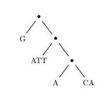
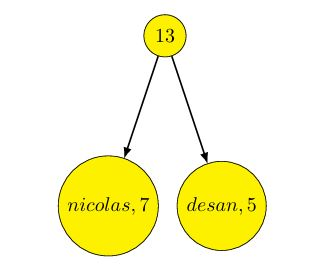

# String Builders

## Enoncé du projet 

La majorité des langages de programmation fournissent une notion primitive de chaîne de caractères. Si ces chaînes s’avèrent adaptées à la manipulation de mots ou de textes relativement courts, elles deviennent généralement inutilisables sur de très grands textes. L’une des raisons de cette inefficacité est la duplication d’un trop grand nombre de caractères lors des opérations de concaténation ou l’extraction d’une sous-chaîne.

Or, il existe des domaines où la manipulation efficace de grandes chaînes de caractères est essentielle (représentation du génome en bio-informatique, éditeurs de texte, ...). Ce projet propose une alternative à la notion usuelle de chaîne de caractères que nous appelons string_builder. Un string_builder est un arbre binaire, dont les feuilles sont des chaînes de caractères usuelles et dont les noeuds internes représentent des concaténations.

Ainsi le string_builder dans Fig.1 représente le mot GATTACA, obtenu par concaténation de quatre mots G, ATT, A et CA. L’intérêt des string_builder est d’offrir une concaténation immédiate et un partage possible de caractères entre plusieurs chaînes, au prix d’un accès aux caractères un peu plus coûteux.



Un string_builder est donc soit un mot (feuille), soit une concaténation de deux autres string_builder (noeud). Note : Pour des raisons d’efficacité, on conserve dans les feuilles, aussi bien que dans les noeuds, la longueur length(c) de la chaîne de caractères c correspondante.

## Préparation 

### Question 1 : 

#### Définir le type string_builder 

Un _string_builder_ est soit un mot (Feuille), soit une concaténation de deux autres _string_builder_ (N). Par ailleurs, on conserve dans les feuilles, aussi bien que dans les noeuds, la longueur length(c) de la chaîne de caractères c correspondante. 

Ainsi, on écrit :

```ocaml
 type string
 builder =
 | Feuille of string ∗ int
 | N of string_builder ∗ int ∗ string_builder ;;
```

Pour avoir les bons indices et pour simplifier l’écriture du code de concat j’ai établi la fonction taille qui prend en argument un _string_builder_ et renvoie la longueure de la chaine de caractère du _string_builder_.

```ocaml
 let rec taille strb = match strb with
 | Feuille ( str ,n) −> n
 |  N( strb1 ,n, strb2 ) −> n;;
```

### Question 2 :

#### Définir une fonction char_at qui prend en argument un entier i et un string_builder représentant le mot [c0;...;cn−1], et qui renvoie le caractère ci. *Note* : On supposera 0 ≤ i < n, et on utilisera la fonction String.get pour obtenir le ie caractère d’une chaîne de caractères.

Pour obtenir le ième caractère du _string_builder_ j’ai utilisé une sous-fonction aux qui prend en argument un _string_builder_ et renvoie la chaine de caractères str correspondante.

Ensuite, on renvoie String.get i str.

```ocaml
 let rec aux strb = match strb with
 | Feuille ( str ,n) −> str
 | N( strb1 ,n, strb2 ) −> (aux strb1)ˆ(aux strb2)
 ;;
```

J’ai réalisé le test sur l’arbre suivant :



```ocaml
let () = assert( char at 10 (N(Feuille("nicolas" ,7), 13, Feuille ("desan" ,5))) = 's'));;
```

