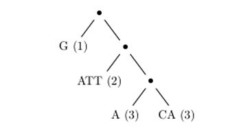
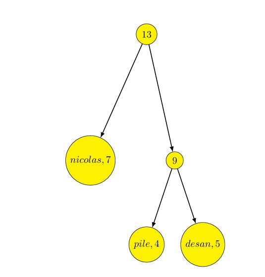
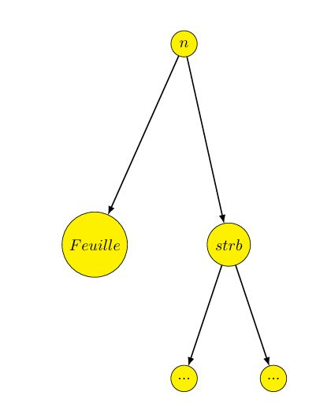
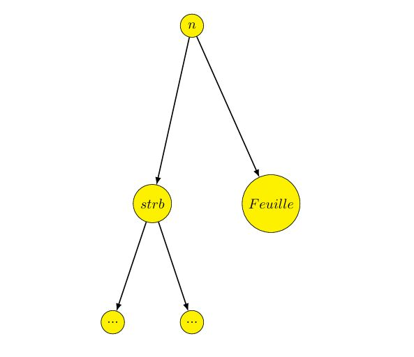
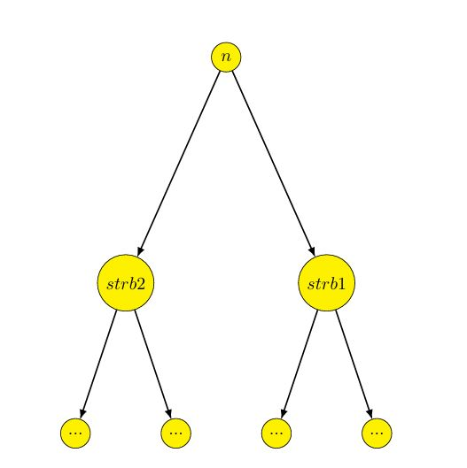

# String Builders

## Enoncé du projet 

La majorité des langages de programmation fournissent une notion primitive de chaîne de caractères. Si ces chaînes s’avèrent adaptées à la manipulation de mots ou de textes relativement courts, elles deviennent généralement inutilisables sur de très grands textes. L’une des raisons de cette inefficacité est la duplication d’un trop grand nombre de caractères lors des opérations de concaténation ou l’extraction d’une sous-chaîne.

Or, il existe des domaines où la manipulation efficace de grandes chaînes de caractères est essentielle (représentation du génome en bio-informatique, éditeurs de texte, ...). Ce projet propose une alternative à la notion usuelle de chaîne de caractères que nous appelons string_builder. Un string_builder est un arbre binaire, dont les feuilles sont des chaînes de caractères usuelles et dont les noeuds internes représentent des concaténations.

Ainsi le string_builder dans Fig.1 représente le mot GATTACA, obtenu par concaténation de quatre mots G, ATT, A et CA. L’intérêt des string_builder est d’offrir une concaténation immédiate et un partage possible de caractères entre plusieurs chaînes, au prix d’un accès aux caractères un peu plus coûteux.


Un string_builder est donc soit un mot (feuille), soit une concaténation de deux autres string_builder (noeud). Note : Pour des raisons d’efficacité, on conserve dans les feuilles, aussi bien que dans les noeuds, la longueur length(c) de la chaîne de caractères c correspondante.

## Préparation 

### Question 1 : 

#### Définir le type string_builder 

Un _string_builder_ est soit un mot (Feuille), soit une concaténation de deux autres _string_builder_ (N). Par ailleurs, on conserve dans les feuilles, aussi bien que dans les noeuds, la longueur length(c) de la chaîne de caractères c correspondante. 

Ainsi, on écrit :

```ocaml
 type string
 builder =
 | Feuille of string ∗ int
 | N of string_builder ∗ int ∗ string_builder ;;
```

Pour avoir les bons indices et pour simplifier l’écriture du code de concat j’ai établi la fonction taille qui prend en argument un _string_builder_ et renvoie la longueure de la chaine de caractère du _string_builder_.

```ocaml
 let rec taille strb = match strb with
 | Feuille ( str ,n) −> n
 |  N( strb1 ,n, strb2 ) −> n;;
```

### Question 2 :

#### Définir une fonction char_at qui prend en argument un entier i et un string_builder représentant le mot [c0;...;cn−1], et qui renvoie le caractère ci. **Note** : On supposera 0 ≤ i < n, et on utilisera la fonction String.get pour obtenir le ie caractère d’une chaîne de caractères.

Pour obtenir le ième caractère du _string_builder_ j’ai utilisé une sous-fonction aux qui prend en argument un _string_builder_ et renvoie la chaine de caractères str correspondante.

Ensuite, on renvoie String.get i str.

```ocaml
 let rec aux strb = match strb with
 | Feuille ( str ,n) −> str
 | N( strb1 ,n, strb2 ) −> (aux strb1)ˆ(aux strb2)
 ;;
```

J’ai réalisé le test sur l’arbre suivant :


```ocaml
let () = assert( char at 10 (N(Feuille("nicolas" ,7), 13, Feuille ("desan" ,5))) = 's'));;
```

### Question 3 :

#### Définir une fonction sub_string qui prend en arguments un entier i, un entier m et un string_builder sb représentant le mot [c0;...;cn−1] et qui renvoie un string_builder représentant le mot [ci;...;ci+m−1], c’est-à-dire la sous-chaîne de c débutant au caractère i et de longueur m. **Note** : On supposera 0 ≤ i < i + m ≤ n, et on s’attachera à réutiliser dans le string_builder résultant autant de sous-arbres de sb que possible.

 J’ai réalisé la fonction sub string grâce aux fonctions auxiliaires :

- **sub string debut** qui prend en argument une chaine de caractère str, un entier i et renvoie les ième premiers caractères de str.
- **sub string fin** qui prend en argument une chaine de caractère str, un entier i et renvoie les caractères de str à partir du rang i.
- **debut** qui prend en argument un string builder strb, un entier i et renvoie le _string_builder_ avec les ième premiers caractères de strb.
- **fin** qui prend en argument un string builder strb, un entier i et renvoie le _string_builder_ avec les caractères de strb à partir du rang i.

Le test a été réalisé avec le même arbre que pour la question 2.

## Equilibrage

Le hasard des concaténations peut amener un string_builder à se retrouver déséquilibré, c’est-à-dire à avoir certaines de ses feuilles très éloignées de la racine et donc d’accès plus coûteux. Le but de cette partie est d’étudier une stratégie de rééquilibrage à posteriori. Considérons un string_builder sb composé de k +1 feuilles, et donc de k noeuds internes. Notons ces k + 1 feuilles m0,...,mk. Lorsqu’on les considère de la gauche vers la droite, si bien que sb représente le mot m0m1...mk. La profondeur de la feuille mi dans sb est notée depth(mi) et est définie comme la distance de mi à la racine de sb. Voici un exemple (Fig. 2) de string_builder pour k=3, où la profondeur de chaque feuille est indiquée entre parenthèses.



Le coût de l’accès à un caractère de la feuille mi est défini comme la profondeur de cette feuille dans sb, soit depth(mi) (on ne considère pas le coût de l’accès dans le mot mi lui-même). Le coût total d’un string_builder est alors défini comme la somme des coûts d’accès à tous ses caractères et vaut donc :


$$
C(sb) = \sum_{i=0}^{k} length(m_i) * depth(m_i)
$$

### Question 4 :

#### Définir la fonction cost qui prend en argument un string_builder et qui renvoie son coût selon la définition précédente.

Le test de la fonction cost à été réalisé sur l’arbre suivant :



```ocaml
 let () = assert( cost (N(Feuille(”nicolas” ,7) , 16, N( Feuille (”pile” ,4) , 9, Feuille (”desan” ,5)))) = 25);;
```
### Question 5 :

#### Définir une fonction random_string qui prend en argument un entier i et qui génère un arbre de profondeur i. Vous présenterez l’algorithme utilisé pour la génération dans votre rapport, et vous discuterez de la pertinence de vos choix. Note : Pensez à consulter la documentation en ligne des modules Random, Char et String.

Afin de réaliser random string, j’ai fait la fonction auxiliaire random word qui prend en argument n et qui renvoie une chaine de caractères aléatoire de longueure n. Pour cela, on utilise 97 + (Random.int 26) qui génère un entier aléatoire correspondant aux lettres de l’alphabet en ASCII.

Ensuite, dans la fonction random string j’ai utilisé (Random.int 3) dans la récurrence pour distinguer trois cas de figures :

- Cas 1 :



- Cas 2 :



- Cas 3 :



